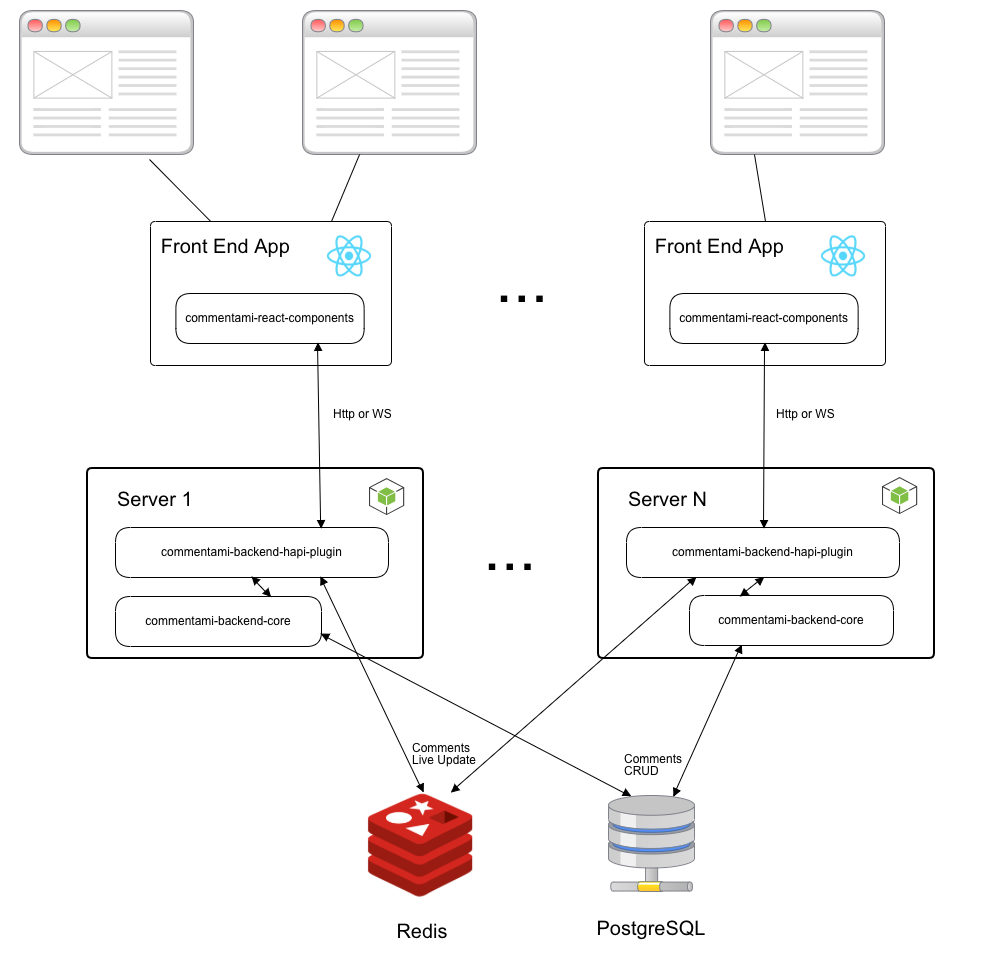

# Commentami - open source commenting system

Commentami is a Google-Docs-like commenting system.

The fronted is based on [Reactjs 16+](https://reactjs.org) and is separetated in `core` components and `ui` components so that you can build your own UI around the logic of handling comments.

Commentami backend can be used as a standalone node.js module ([commentami-backend-core](https://github.com/nearform/comments/tree/master/packages/commentami-backend-core)) or as a Hapi (17+) server plugin that provides a REST API and websockets ([commentami-backend-hapi-plugin](https://github.com/nearform/comments/tree/master/packages/commentami-backend-hapi-plugin)).

## Background

Collaboration in modern applications is a killer feature. An open source Google-Docs-like commenting system can be used to ask feedback on our content, or to create specific features for your app. Moreover, hooking comments to your existing app should be easy and should leave you only with building your UI and hook it up with the logic to handle comments.

Commentami offers the following features:

- CRUD comments with HTTP REST API
- CRUD comments with Websockets
- Registering mentions in comments
- Events for comment added/updated/deleted
- Realtime notifications when using websockets (mentions and answers to comments)
- Realtime updates for discussions when using websockets
- Deep-linking in comments notifications
- Hooks to decorate comments with your domain specific data (ie: users data for author and mentions)
- React components to handle comments logic and UI components to expand/take inspiration from


## CORE CONCEPTS

In Commentami a comment is an obejct with the following properties

```
Comment {
  id, // numeric
  resource, // long string
  reference, // string
  content, // text
  author, // optional value, string
  mentions, // array of mentions @<identifier> found in the comment content
  createdAt // datetime
}
```

The main idea is that a comment belongs to a `resource` (ie: a web page) and to a `reference` (ie: a paragraph or page section).

The `resource` and the `reference` are loosly defined to accomodate different interpretations, but a comment needs both to exists.

The provided react components are used to interact with the Commentami server (list, add and delete comments). They also provide a way to mark elements on the page as commentable and deal with the wiring of commentable elements and their comments.

***Platform Logical Architecture***


## REST API

|Path|Method|Summary|
|----|------|-------|
|`/comments-references/{resource*}`|GET|List all referencences belonging a resource|
|`/comments?resource=...[&reference=...][&limit=...][&offset=...]`|GET|Paginated list of comments. Query parameters: `resource`, `reference`, `limit`, `offset`. **Note:** the `resource` query parameter is mandatory|
|`/comments`|POST|Create a new comment|
|`/comments/{id}`|PUT|Update a comment `content` field|
|`/comments/{id}`|DELETE|Delete a comment|
|`/comments/{id}`|GET|Get single comment|


## WEBSOCKETS

Commentami comes with a ready made socket server that you can intercat with using [`nes` client](https://github.com/hapijs/nes#client).

You will have all REST API endpoints mapped in the socket and also the ability to:

- subscribe resources and (optionally) references to receive updates if a comment is added/deleted/updated on those resources/references
- subscribe to user notifications (mentions, answers to user's comments)

## REACT COMPONENTS

The interface of each web application is different. To accomodate that, we structured our components in `core` and `ui` components. This distiction should be read as

- `core`: dealing with the logic behind the fornted and the interaction with the backend
- `ui`: components that can be replaced to accomodate each web application UI

We also have 2 ready made `service` components:

- `HttpService`: to interact with the server HTTP REST API
- `WebsocketService`: ot interact with the socket server

This two components can be used directly or taken as an example.

## NEXT STEPS

To get up and running with Commentami, see the installation steps in the [README](https://github.com/nearform/commentami).

See an example on how to [configure the server to deal with authentication and users data](/example-auth-and-user-data)

See an example on how to use [realtime notifications](/example-notifications)

See an example on how to [customize the frontend](/example-frontend)
